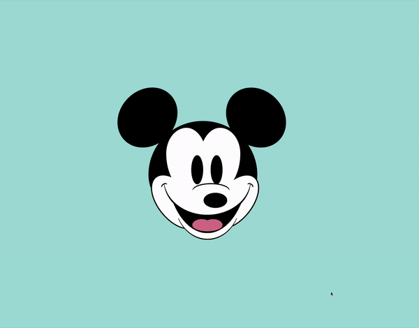

# 🐭 Mickey Mouse Animation

This project features an animated Mickey Mouse head that follows the cursor movements, showcasing CSS and JavaScript interactions.

## 📦 Technologies

Built with:

- `HTML:` Markup language for creating the structure.
- `CSS:` For styling and animations.
- `JavaScript:` For interactivity and handling cursor movements.

## ⚙️ Getting Started

To view and interact with the Mickey Mouse animation:

1. Download the project files.
2. Open the `index.html` file in Visual Studio Code.
3. Use the Live Server extension in VS Code to view the project in your web browser.

## 🖱️ Interaction

Open the project in your browser and move your cursor around to see Mickey Mouse's head and features follow the movement.

## 🛣️ Project Structure

Here are the key files and their purposes:

- **index.html**: The main HTML file containing the structure of the Mickey Mouse animation.
- **style.css**: The CSS file that styles the Mickey Mouse head and adds animations.
- **script.js**: The JavaScript file that handles the cursor movement and interaction.

Feel free to explore and customize these files to suit your needs!

## 📱 Responsive Design

- The Mickey Mouse animation is responsive, ensuring a seamless experience on both desktops and mobile devices.

## 🔄 Animations

The Mickey Mouse animation includes various CSS animations and JavaScript interactions. Here’s an overview:

- **Interactive Movement**: Mickey Mouse's head and features follow the cursor movement.
- **Responsive Animations**: Smooth transitions and animations for different screen sizes.
